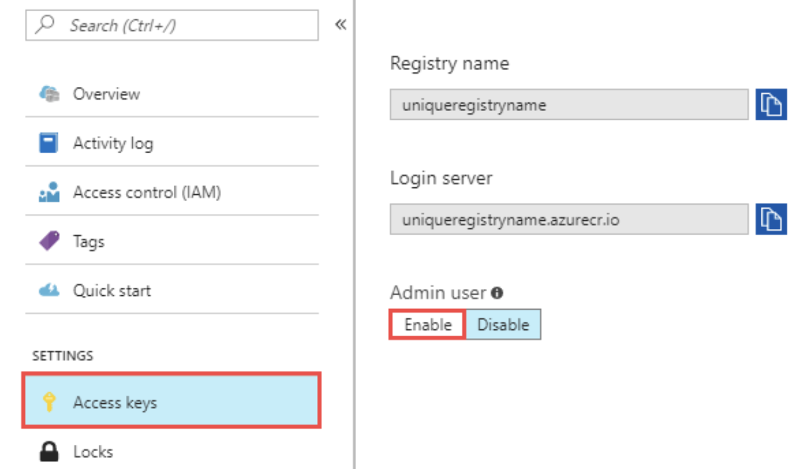
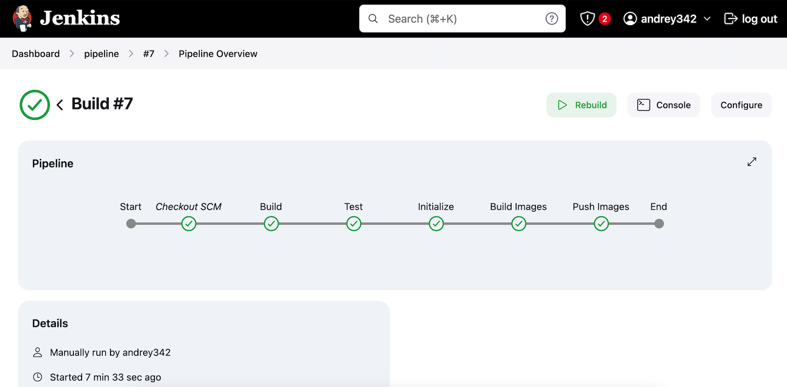
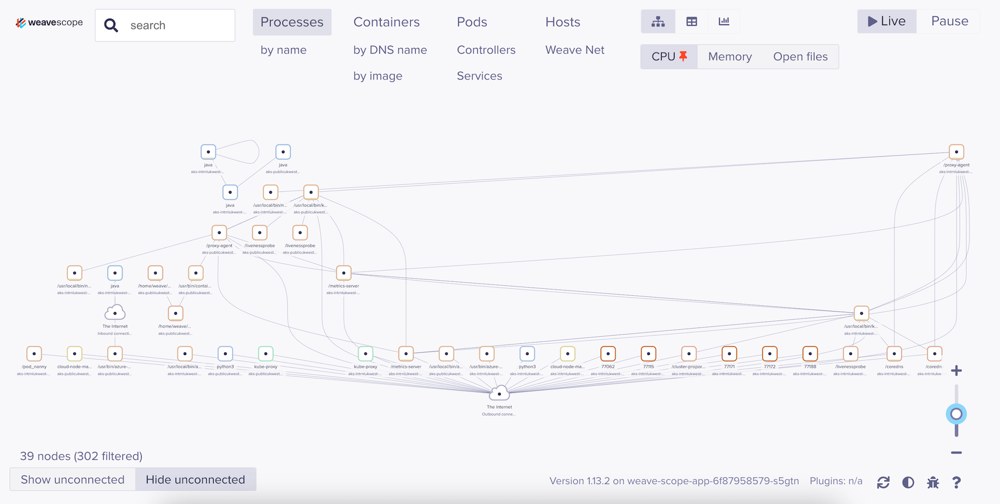
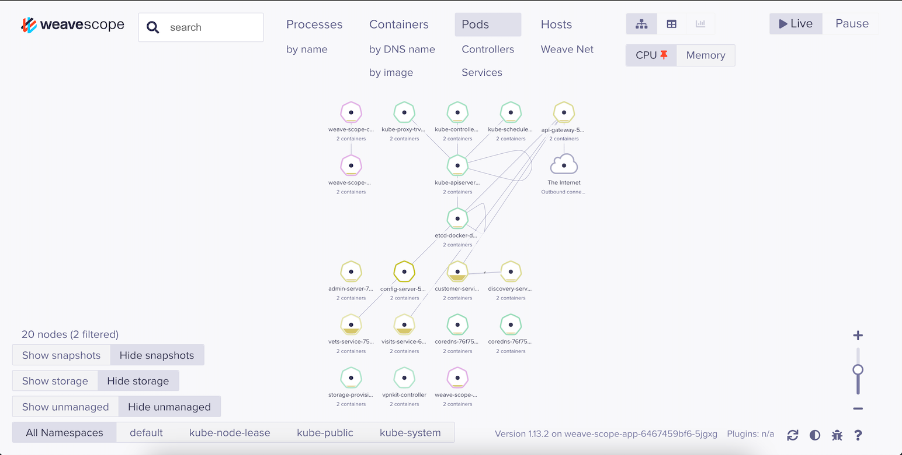

# Azure WebClinic Project 🏥

Welcome to the Azure WebClinic project! This project rebuilds the microservices architecture of the Spring PetClinic application, which was slightly modified to enable deployment using Kubernetes, both with and without Docker. You can find the original microservices [here](link-to-original-microservices).

## Technologies Used 🛠️
<p align="left">
  
  
  
  
  
  
  
  
</p>

## Prerequisites 📋
- Install Terraform: [Terraform Installation Guide](terraform-installation-guide-link)
- Install Azure CLI: [Azure CLI Installation Guide](azure-cli-installation-guide-link)
- Install Docker: [Docker Installation Guide](docker-installation-guide-link)
- Install Kubernetes CLI (kubectl): [Kubectl Installation Guide](kubectl-installation-guide-link)
- If you're running CI/CD pipeline from my scripts, you need to install Maven: [Maven Installation Guide](maven-installation-guide-link)

## Project Setup 🚀

### Step 1: Configure Terraform ⚙️
1. Open the `terraform.tfvars` file.
2. Set the necessary variables.
3. Apply the Terraform configuration:
   ```sh
   terraform init
   terraform apply
   ```

### Step 2: Database Configuration 🗄️
#### Local MySQL:
1. Run MySQL locally using Docker:
   ```sh
   docker run --name local-mysql -e MYSQL_ROOT_PASSWORD=yourpassword -e MYSQL_DATABASE=petclinic -p 3306:3306 -d mysql:5.7
   ```
2. Set `create_database = false` in `terraform.tfvars`.

#### Azure MySQL:
1. Set `create_database = true` in `terraform.tfvars`.
2. Retrieve MySQL credentials from Azure Key Vault.
3. Update `application.yml` to use environment variables for datasource configuration:
   ```yaml
   spring:
     datasource:
       url: ${DATASOURCE_URL} 
       username: ${DATASOURCE_URL_USERNAME}
       password: ${DATASOURCE_URL_PASSWORD}
   ```
Here’s an example of how to pass an environment variable with credentials via the terminal:

```sh
export DATASOURCE_URL="jdbc:mysql://<mysql_server_name>:3306/petclinic?useSSL=false"
export DATASOURCE_URL_USERNAME="your_username"
export DATASOURCE_URL_PASSWORD="your_password"
```

4. Update `application.yaml` in the `config/application.yaml` directory with the above configuration.
Here’s an example of how to pass an environment variable with credentials via the terminal
```
jdbc:mysql://<mysql_server_name>:3306/petclinic?useSSL=false
```

5. (Optional) If you want to manage your MySQL database manually, you can install MySQL Workbench: [MySQL Workbench Installation Guide](mysql-workbench-installation-guide-link).

### Step 3: Kubernetes Cluster Setup ☸️
1. Install Kubernetes CLI (kubectl): [Kubectl Installation Guide](kubectl-installation-guide-link).
2. Update your cluster credentials:
   ```sh
   az aks get-credentials --resource-group webclinic --name <CLUSTER_NAME>
   ```
3. Label your nodes:
   ```sh
   kubectl get nodes --show-labels
   kubectl label node aks-publicukwest-21622167-vmss000000 type=Public
   kubectl label node aks-internalukwest-21622167-vmss000001 type=Internal
   ```
   We created two nodes, "Public" and "Internal," to ensure proper segregation of services. The "Internal" node hosts services like "visits," "vets," and "customers," which are not publicly accessible. The "Public" node, on the other hand, is publicly accessible and is where we deploy the API gateway (the entry point) and Jenkins if we use it.

To deploy all the services, use the provided script located in the main root directory called `deploy.sh`. This script will deploy the services in the required sequence.

### Step 4: Azure Container Registry (ACR) Configuration
1. Find your ACR URL and credentials in the Azure portal. .

2. Apply Jenkins manifests:
   ```sh
   kubectl apply -f kubernetes/jenkins-deployment.yaml
   kubectl apply -f kubernetes/jenkins-service.yaml
   ```

### Step 5: Jenkins Setup 🧩
Install necessary Jenkins plugins and configure tools:
- After deploying Jenkins, navigate to Jenkins and install the following plugins:
  - Docker Pipeline
  - GitHub Integration
  - Kubernetes CLI

- Next, configure tools in Jenkins:
  - Go to Jenkins -> Manage Jenkins -> Global Tool Configuration.
  - Add tools such as Maven and Docker, ensuring their names match those used in your Jenkinsfile (`Jenkinsfile`).

Set up Jenkins pipeline:
1. Configure credentials in Jenkins for ACR and GitHub:
   - Go to Jenkins -> Manage Jenkins -> Manage Credentials -> Add Credentials.
   - Add your ACR credentials (`acrcred`) and GitHub credentials.

2. Create a Jenkins pipeline:
   - Navigate to Jenkins and click on "New Item" to create a new pipeline.
   - Name your pipeline and select "Pipeline" as the type.
   - In the pipeline configuration:
     - Specify your GitHub repository credentials (access token or username/password).
     - Add your ACR credentials and provide the information retrieved from Step 4 (ACR URL and Credentials).
     - Set the path to your Jenkinsfile located at `ci/cd/Jenkinsfile`.
     - Save your pipeline configuration.

3. Run the pipeline:
   - Trigger the pipeline manually or set up webhooks to trigger it automatically on code changes.
   - Ensure the pipeline runs successfully.

An example output of a successful pipeline run should resemble the following:



Please configure your Jenkins pipeline accordingly, and ensure all credentials and paths are correctly set up as described.

The Jenkins setup uses the scripts `dockerbuild.sh` and `dockerpush.sh` to build and push Docker images for the seven microservices. Each microservice requires its own Docker image, and the scripts handle the Dockerfile mapping, ports, and path to JAR files. 

The Dockerfile template used is:
```Dockerfile
FROM eclipse-temurin:17 as builder
WORKDIR /application

ARG JARPATH
COPY ${JARPATH} application.jar
RUN java -Djarmode=layertools -jar application.jar extract

FROM eclipse-temurin:17
WORKDIR /application

ARG PORT
EXPOSE ${PORT}

COPY --from=builder application/dependencies/ ./
RUN true
COPY --from=builder application/spring-boot-loader/ ./
RUN true
COPY --from=builder application/snapshot-dependencies/ ./
RUN true
COPY --from=builder application/application/ ./

ENTRYPOINT ["java", "org.springframework.boot.loader.launch.JarLauncher"]
```

Please configure your Jenkins pipeline accordingly, and ensure all credentials and paths are correctly set up as described.

### Jenkins Alternative: Shell Script with Dialect Interface 🐚
As an alternative to Jenkins, you can use the provided shell script which uses Dialect as a user interface. This script checks all possible scenarios, such as installed dependencies, your operating system, and more. All you need to do is run the script and follow the prompts via the user interface, such as entering your registry URL, path to your services, and custom ports if they were changed in the applications.
   ```sh
   bash marmalade.sh
   ```


### Weave Scope Setup 🔍
To monitor your microservices architecture, you can use Weave Scope. Follow these steps:

1. Run the `docker-compose.yml` file:
   ```sh
   docker-compose up -d
   ```
2. Open Weave Scope on `localhost:4040` to visualize and manage your microservices architecture.

The liveness and readiness probes for the services were configured based on insights from Weave Scope. Additionally, you can see the microservices architecture within Weave Scope:




## Additional Resources 📚

- [Azure Documentation](https://docs.microsoft.com/azure/)
- [Terraform Documentation](https://www.terraform.io/docs/)
- [Kubernetes Documentation](https://kubernetes.io/docs/)
- [Docker Documentation](https://docs.docker.com/)

Happy coding! 🚀